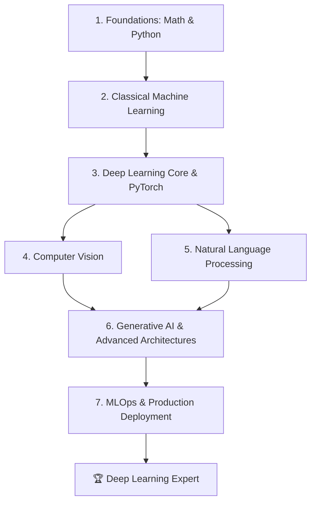

# Complete Deep Learning & Generative AI Roadmap (Zero to Expert)

Welcome to your comprehensive roadmap to becoming an expert in Deep Learning (DL). This guide is structured sequentially, moving from foundational math and programming to advanced architectures, Large Language Models (LLMs), and production deployment (MLOps). 

To become an expert who can practically implement and debug complex systems, you must balance **theory (understanding *why* things work)** with **practice (writing code from scratch, debugging, and scaling)**.

---

## 🗺️ Learning Path Overview

---

## Phase 1: Foundations (Mathematics & Programming)
Before writing neural networks, you need the language they are built on: Linear Algebra, Calculus, Probability, and Python.

### 📚 Study Sources
*   **Mathematics**:
    *   *Mathematics for Machine Learning* (Book, Free): [mml-book.github.io](https://mml-book.github.io/)
    *   *Imperial College London's Mathematics for Machine Learning* (Coursera): Great for intuitive linear algebra and multivariate calculus.
    *   *3Blue1Brown's Essence of Linear Algebra / Calculus* (YouTube): Crucial for visual intuition.
*   **Programming**:
    *   *Python for Data Analysis* by Wes McKinney (creator of Pandas).
    *   *NumPy Vectorization Techniques*: Learn to avoid loops; vectorization is how GPUs process data.

### 🛠️ Practical Projects
*   **Project 1.1: NumPy-Only Neural Network from Scratch**
    *   **Goal**: Build a 2-layer Multilayer Perceptron (MLP) using only NumPy (no PyTorch/TensorFlow).
    *   **Skills**: Manually compute the forward pass, calculate gradients via backpropagation (chain rule), and implement gradient descent to classify the MNIST digit dataset.
    *   **Why**: If you can't build it in NumPy, you don't truly understand how gradients flow through a network.

---

## Phase 2: Classical Machine Learning
Deep learning is a subset of machine learning. You must understand basic ML principles like overfitting, regularization, and model validation before jumping to neural networks.

### 📚 Study Sources
*   *Hands-On Machine Learning with Scikit-Learn, Keras, and TensorFlow* (Book) by Aurélien Géron: The absolute gold standard for practical ML. Read Chapters 1 through 9.
*   *Introduction to Statistical Learning (ISLR)* (Book, Free): Excellent for understanding the statistical foundation of models.
*   *Machine Learning Zoomcamp* by DataTalksClub (Free Course/Cohort): Highly practical.

### 🛠️ Practical Projects
*   **Project 2.1: End-to-End Predictive Pipeline**
    *   **Goal**: Train a model to predict housing prices or customer churn using Scikit-Learn.
    *   **Skills**: Data cleaning, feature engineering, handling missing values, cross-validation, hyperparameter tuning (GridSearchCV), and evaluation metrics (ROC-AUC, F1-Score).

---

## Phase 3: Deep Learning Core & PyTorch
Here you transitions to neural networks. PyTorch is the industry and research standard framework.

> [!TIP]
> Do not spend too much time learning multiple frameworks. Focus 100% on **PyTorch**. Once you master PyTorch, transitioning to others (JAX, TensorFlow) is trivial.

### 📚 Study Sources
*   **Courses**:
    *   *Practical Deep Learning for Coders* by fast.ai (Free): A top-down approach (train models first, understand theory later). Highly recommended.
    *   *Deep Learning Specialization* by Andrew Ng (Coursera/YouTube): The best bottom-up course to understand the theoretical mechanics.
*   **Books**:
    *   *Understanding Deep Learning* by Simon J.D. Prince (Book, Free PDF): The most modern and comprehensive textbook on DL.
    *   *Programming PyTorch for Deep Learning* by Ian Pointer.

### 🛠️ Practical Projects
*   **Project 3.1: Custom PyTorch Image Classifier**
    *   **Goal**: Build and train a Convolutional Neural Network (CNN) on CIFAR-10 from scratch in PyTorch.
    *   **Skills**: Writing custom `Dataset` and `DataLoader` classes, implementing training/validation loops, using learning rate schedulers, handling GPU/CPU device placement, and visualizing training metrics with TensorBoard or Weights & Biases.

---

## Phase 4: Computer Vision (CV)
Computer Vision was the catalyst for the modern deep learning boom. Understanding spatial hierarchies in data is crucial.

### 📚 Study Sources
*   **Courses**:
    *   *Stanford CS231n: Deep Learning for Computer Vision* (Free on YouTube): The absolute best academic course on CV.
*   **Key Architectures to Study**: ResNet, ConvNeXt, Vision Transformers (ViT).

### 🛠️ Practical Projects
*   **Project 4.1: Custom Object Detector (YOLO or Faster R-CNN)**
    *   **Goal**: Train an object detector to locate custom objects (e.g., detecting license plates or specific products).
    *   **Skills**: Data labeling (using Roboflow/CVAT), transfer learning, understanding bounding box regressions (IoU, Non-Maximum Suppression), and evaluating with Mean Average Precision (mAP).
*   **Project 4.2: U-Net Medical Image Segmentation**
    *   **Goal**: Segment tumors or organs from MRI/CT scan images.
    *   **Skills**: Pixel-level classification, Dice loss, transposed convolutions, and skip connections.

---

## Phase 5: Natural Language Processing (NLP) & Transformers
NLP has transitioned entirely to Transformer-based architectures.

### 📚 Study Sources
*   **Courses**:
    *   *Stanford CS224n: Natural Language Processing with Deep Learning* (Free on YouTube): Outstanding deep dive into sequential models and Transformers.
    *   *Hugging Face NLP Course* (Free): Excellent practical guide to using the `transformers` library, tokenizers, and datasets.
*   **Key Papers to Read**:
    *   *Attention Is All You Need* (Vaswani et al., 2017): The paper that started the modern AI era.
    *   *BERT* and *GPT* original papers.

### 🛠️ Practical Projects
*   **Project 5.1: Character-level GPT from Scratch**
    *   **Goal**: Write a mini-GPT model (decoder-only Transformer) from scratch in raw PyTorch.
    *   **Skills**: Implementing Multi-Head Attention, Causal Masking, Layer Normalization, Positional Encodings, and training the model to generate Shakespeare-like text.
    *   *Tip: Follow Andrej Karpathy's "Zero to Hero" playlist on YouTube for this project.*
*   **Project 5.2: Parameter-Efficient Fine-Tuning (PEFT) of an LLM**
    *   **Goal**: Fine-tune a 7B parameter open-source LLM (like Llama 3 or Mistral) on a specific domain (e.g., legal or medical QA).
    *   **Skills**: LoRA, QLoRA (quantized fine-tuning), formatting datasets for instruction tuning, and tracking training dynamics.

---

## Phase 6: Generative AI & Advanced Architectures
Beyond text and basic classifiers, learn how AI generates media and reasons.

### 📚 Study Sources
*   *Hugging Face Diffusion Models Class* (Free): Learn the math and code behind stable diffusion.
*   *Generative Deep Learning* (O'Reilly Book) by David Foster.

### 🛠️ Practical Projects
*   **Project 6.1: Diffusion Model from Scratch**
    *   **Goal**: Implement a Denoising Diffusion Probabilistic Model (DDPM) to generate hand-written digits or simple images.
    *   **Skills**: Understanding noise schedules, forward/reverse diffusion processes, training a U-Net to predict noise, and classifier-free guidance.
*   **Project 6.2: Production RAG (Retrieval-Augmented Generation)**
    *   **Goal**: Build a document search engine that queries complex PDFs and answers questions using a local LLM.
    *   **Skills**: Chunking strategies, embedding generation, vector databases (ChromaDB, Pinecone, or pgvector), and hybrid search (BM25 + Semantic Search).

---

## Phase 7: MLOps (Deep Learning in Production)
An expert is not someone who only trains models in Jupyter Notebooks. An expert knows how to package, deploy, monitor, and scale models.

### 📚 Study Sources
*   *Made With ML* by Goku Mohandas (Free): An incredible curriculum on production-grade machine learning.
*   *Full Stack Deep Learning* (Free Course): Focuses on the entire lifecycle of deep learning projects.

### 🛠️ Practical Projects
*   **Project 7.1: Dockerized, High-Throughput Inference Service**
    *   **Goal**: Take one of your trained models (e.g., the CIFAR-10 classifier or fine-tuned LLM) and serve it to handle concurrent requests.
    *   **Skills**: Packaging code with Docker, writing a FastAPI server, optimizing inference speed (using ONNX Runtime, TensorRT, or vLLM), and writing CI/CD workflows (GitHub Actions) to test and deploy the model container.

---

## 💡 Pro-Tips for Becoming an "Expert"

1.  **Stop Using Jupyter Notebooks for Big Tasks**: Use notebooks for exploratory data analysis (EDA) and prototyping. Write production code in structured modular files (using VS Code or cursor/IDE) with proper logging, config managers (like Hydra or argparse), and tests.
2.  **Read and Implement Papers**: Pick classic papers (ResNet, Attention is All You Need, LoRA) and try to write the model architectures based *only* on the paper's description and equations, without looking at public GitHub code.
3.  **Learn to Debug Gradients**: Understand how to debug exploding/vanishing gradients. Use tools like PyTorch's anomaly detection (`torch.autograd.set_detect_anomaly(True)`) and monitor weight/gradient distributions in dashboard tools.
4.  **Understand GPU Architecture**: Learn how CUDA works under the hood. Learn how precision (FP32 vs FP16 vs BF16 vs INT8/INT4 quantization) affects memory usage and throughput. If you understand GPU memory, you can train larger models on smaller budgets.
